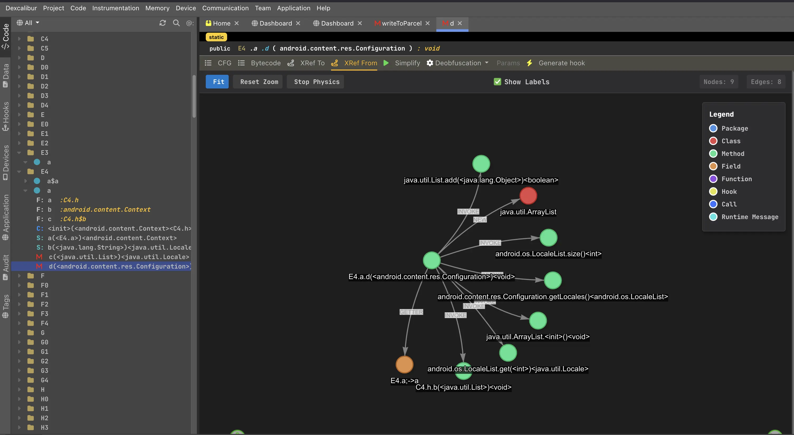

# Technical UI for Reversense platform

This UI is designed for security professional / reverser.



## 1. Setup

You don't need to install anything until you expect to contrinute. 
This project is one of built-in UI of Reversense, and it is always shipped with. 

## 2. Contribute

1. Ensure `DXC_CODEBASE` environment variable is set to folder where Reversense server (dexcalibur) is located.
2. Fork the project
3. Create your feature branch (`git checkout -b my-new-feature`)
4. Make your changes and `ng build --base-href /pro/ && ln -s $PWD/dist/dxc-ui-reverse $DXC_CODEBASE/dist/src/webserver/www/pro`
5. Commit your changes (`git commit -am 'Add some feature'`)
6. Push to the branch (`git push origin my-new-feature`)
7. Create new Pull Request

## 3. Development 

This is an Angular project. The best way to test is to build your project and create a symbolic link to `DXC_CODEBASE/dist/src/webserver/www/pro`.

## 4. Troubleshoot

### Blank Screen / WSOD

If you experiment a blank screen (WSOD), please verify the URL ends with `/#/home`.

## 6. Bonus 

Particle animations
```
$particleSize: 20vmin;
$animationDuration: 6s;
$amount: 20;
div.screen span.dxcanim {
  width: $particleSize;
  height: $particleSize;
  border-radius: $particleSize;
  backface-visibility: hidden;
  position: absolute;
  z-index:0;
  animation-name: move;
  animation-duration: $animationDuration;
  animation-timing-function: linear;
  animation-iteration-count: infinite;
  $colors: (
    #583C87,
    #E45A84,
    #FFACAC
  );
  @for $i from 1 through $amount {
    &:nth-child(#{$i}) {
      color: nth($colors, random(length($colors)));
      top: random(100) * 1%;
      left: random(100) * 1%;
      animation-duration: (random($animationDuration * 10) / 10) * 1s + 10s;
      animation-delay: random(($animationDuration + 10s) * 10) / 10 * -1s;
      transform-origin: (random(50) - 25) * 1vw (random(50) - 25) * 1vh;
      $blurRadius: (random() + 0.5) * $particleSize * 0.5;
      $x: if(random() > 0.5, -1, 1);
      box-shadow: ($particleSize * 2 * $x) 0 $blurRadius currentColor;
    }
  }
}

@keyframes move {
  100% {
    transform: translate3d(0, 0, 1px) rotate(360deg);
  }
}

```